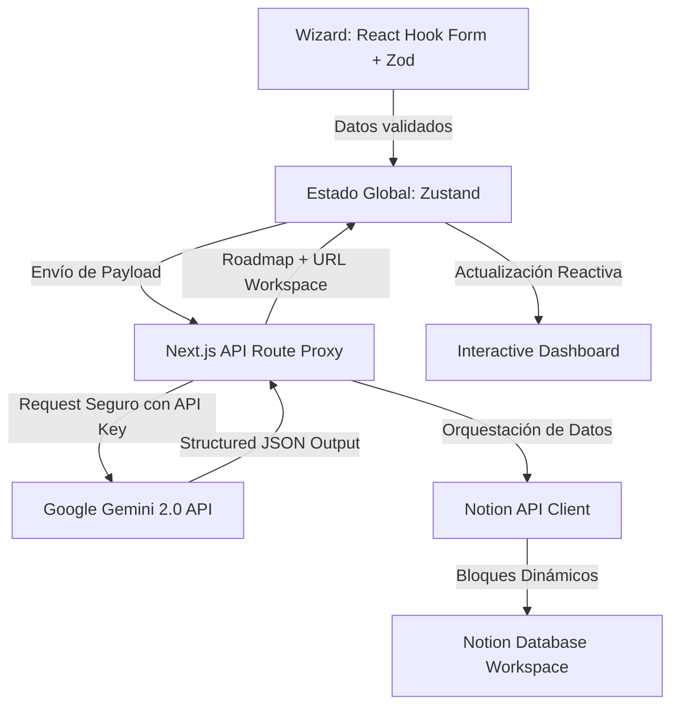

# Career OS AI

Planifica tu carrera con Inteligencia Artificial y materializa tus objetivos de crecimiento en un espacio de productividad dinámico.

---

## 🚀 Visión del Producto

**Career OS AI** es un ecosistema inteligente diseñado para resolver la fricción fundamental en el crecimiento profesional: **la brecha entre la ambición y la ejecución**. 

A través de un flujo intuitivo y gamificado, el sistema recopila las habilidades, metas de tiempo, cursos y proyectos del usuario. Un motor de Inteligencia Artificial analiza esta información contextual para generar un plan de acción estructurado y personalizado, el cual es exportado en tiempo real a Notion. Esto permite a los desarrolladores y profesionales tech pasar de una visión abstracta a un tablero operativo estructurado en cuestión de segundos.

---

## 🛠️ Arquitectura del Sistema (Technical Deep Dive)

La aplicación sigue una arquitectura modular en el frontend y una capa segura de servicios serverless en el backend:

### Flujo de Datos Técnico:
1. **Orquestación del Cliente (Zustand)**: El formulario multi-paso recolecta y valida la información del usuario en cada pantalla. Una vez completado, el estado consolidado se envía en un solo payload optimizado a nuestro endpoint proxy.
2. **API Proxy Seguro**: Las rutas de API de Next.js (`/api/generate-system`) sirven como un puente seguro, ocultando credenciales sensibles (`NOTION_TOKEN`, `GEMINI_API_KEY`) del lado del cliente.
3. **Generación con Structured Outputs**: Se realiza una consulta a la API de **Gemini** configurando `responseMimeType: 'application/json'` y definiendo un `responseSchema` estricto en el SDK. Esto garantiza que la respuesta sea un array JSON analizable con propiedades consistentes.
4. **Integración con la API de Notion**: Recibido el JSON estructurado, la ruta del backend inicializa el cliente oficial de Notion (`@notionhq/client`) y crea una nueva página dentro de la base de datos relacional del usuario, insertando los bloques dinámicos para el roadmap personalizado.
5. **Consumo Dinámico**: La API responde con el roadmap generado y la URL de Notion, actualizando el store de Zustand para sincronizar de manera reactiva la interfaz del Dashboard.

---

## ⚡ Características Destacadas (Engineering Highlights)

*   **Manejo Resiliente de Rate Limits (429 UX)**: Intercepción inteligente de códigos de estado de cuota excedida (`RESOURCE_EXHAUSTED` / `429`) de la API de Gemini. En lugar de fallar de manera silenciosa o congelar la UI, el sistema responde con estados amigables que permiten al usuario reintentar sin perder su progreso en el formulario.
*   **Tipado Estricto de Datos**: Implementación completa de TypeScript en el pipeline de datos, eliminando por completo cualquier tipo `any` implícito. Definición de contratos claros (`RoadmapItem`, `NotionPageResponse`) que facilitan el mantenimiento del código.
*   **UI/UX Ultra Fluida**: Navegación dinámica entre pasos y vistas del Dashboard implementada con transiciones físicas basadas en `framer-motion` y controles reactivos asistidos por `react-hook-form`.
*   **Estructuración Dinámica de Bloques Notion**: Conversión del JSON de salida de la IA a la jerarquía compleja de bloques estructurados requerida por Notion, aplicando formato de anotaciones enriquecidas (negritas, encabezados) de forma dinámica.

---

## 💻 Stack Tecnológico

### Frontend
- **Framework**: Next.js 15 (App Router + React Server Components)
- **Manejo de Estado**: Zustand
- **Validación de Formularios**: React Hook Form + Zod
- **Estilos**: Tailwind CSS v4 (Modern CSS Architecture)
- **Animaciones**: Framer Motion (Transiciones de hardware aceleradas)
- **Iconografía**: Lucide React

### Backend & Integraciones
- **API Engine**: Next.js Serverless Route Handlers
- **AI Core**: Google Generative AI SDK (Gemini API Integration)
- **Base de Datos / Productividad**: Notion SDK Client
- **Lenguaje**: TypeScript (Strict Mode)
